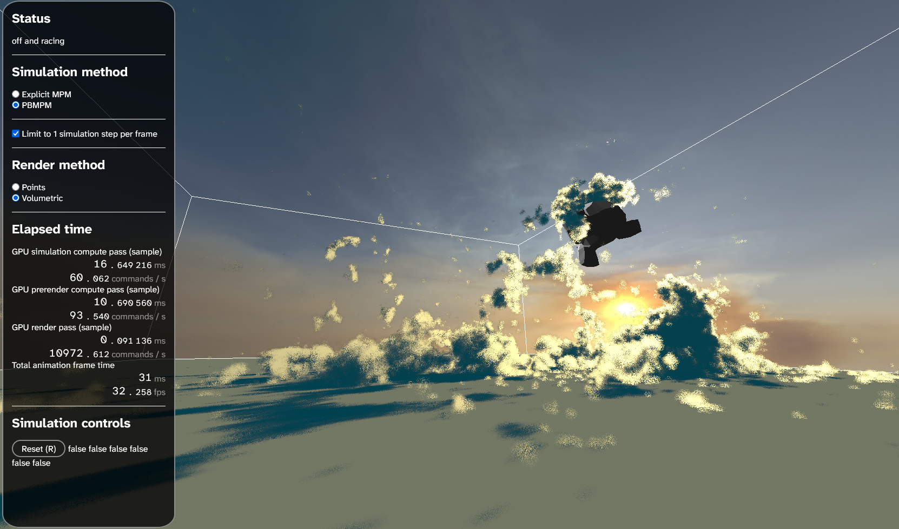
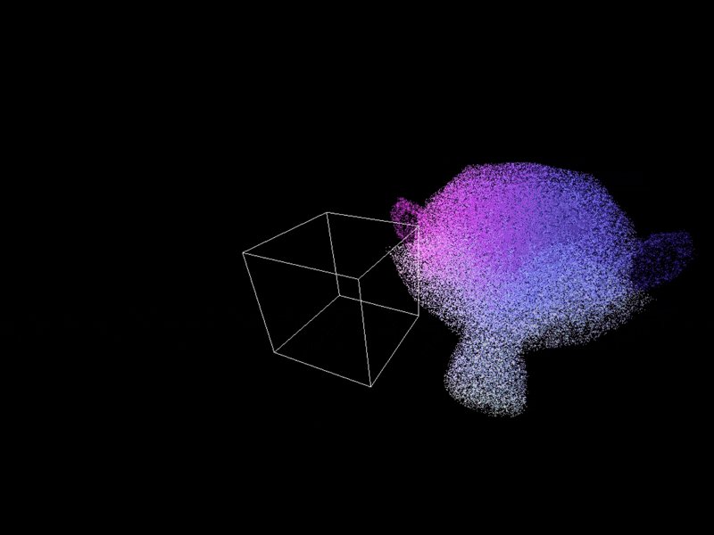
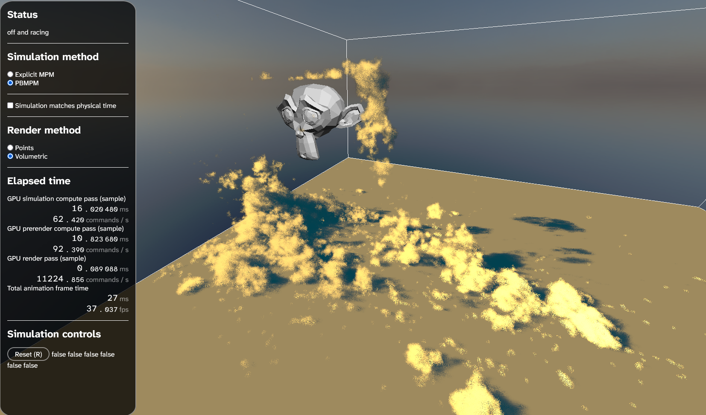

# WebGPU snow sim
This project contains a snow simulation engine using the **material point method** (**MPM**) algorithm.

You can [view this demo online](https://luoluobuli.github.io/WebGPU-MPM-based-Snow-Simulation/) so long as your browser supports WebGPU!

<!--  -->

## Features
1. **Position-based MPM (PBMPM)** for numerical stability
1. **Explicit MPM** for cohesion, alongside:
    1. **Elastic deformation and stress forces** to simulate soft materials
        ||
        |-|
    1. **Plastic deformation** to simulate fracture and tearing
        ||
        |-|
    1. **Hardening** to simulate snow better
2. **Rigid colliders** for particles to interact with a more interesting scene
    |||
    |-|-|
3. **Volumetric raymarching** for fluffy material rendering
    |||
    |-|-|

## Code
This is a SvelteKit project with a simulation powered by WebGPU.

### Local development
After cloning this repository:
1. Setup: `npm i` (Node.js) or `deno i` (Deno)
1. Run: `npm run dev` or `deno task dev`

## Motivation
Existing simulation systems in 3D tools like Blender are somewhat limited. There are simulations for mesh-based solids (cloth/rigid body) and simulations for particle-based solids (soft body), liquid (fluid), and gas (smoke). However, at present, there isn't exactly a solution for fragile materials like snow or jelly that only sometimes stay together and sometimes break apart.

The closest practical solution there is is to pre-fracture a mesh, sometimes manually if there are not many pieces or otherwise using a "cell fracture" mechanism which tends to be pretty easy to spot visually. In movies, simulations have evolved to use certain techniques which better support semi-solid materials. For this project, we'll focus on the "material point method", which is an algorithm often leveraged for snow, as with *Frozen* in 2013. One goal of this project is to implement and describe this technique in an accessible and customizable way, both to demonstrate its benefits as well as lay the groundwork for engine implementations for artistic use in tools like Blender.

An additional point of interest is animated characters. Even in industry tooling, characters made of a simulatable material like sand, snow, or water often simply consist of a mesh styled to look like the material, with a particle system on its surface. A large amount of manual labor is necessary to model simple interactions with other characters or meshes in a believable way, such as controllers to decide when and where to fracture the mesh into pre-factured pieces or blend between the mesh and a particle system. We'd like to investigate how easily a simulation can achieve similar results; importing meshes and animations to the scene, while maintaining ease of artistic control, is an additional point of interest.

## Implementation
[Hey kid, want some implementation details...?](./docs/implementation.md)

## Resources
1. ***[A Material Point Method For Snow Simulation](https://disneyanimation.com/publications/a-material-point-method-for-snow-simulation/)*.** The 2013 Disney paper proposing MPM for simulating snow.
1. **[Breakpoint](https://github.com/danieljgerhardt/Breakpoint).** A DirectX implementation of 3D PBMPM with mixed material types, along with a mesh shading renderer.
1. **[GPUMPM](https://github.com/kuiwuchn/GPUMPM).** A CUDA implemenation of MPM, associated with the 2019 paper ***[GPU optimization of material point methods](https://dl.acm.org/doi/10.1145/3272127.3275044)***.
1. **[PB-MPM](https://github.com/electronicarts/pbmpm).** The original WebGPU proof-of-concept implementation of 2D PBMPM with various material types, associated with the original 2024 paper introducing PBMPM, ***[A Position Based Material Point Method](https://media.contentapi.ea.com/content/dam/ea/seed/presentations/seed-siggraph2024-pbmpm-paper.pdf)***. *(although internal forces seem to be broken at the moment, as of 2025-11-21...)*
1. ***[Principles towards Real-Time Simulation of Material Point Method on Modern GPUs](https://arxiv.org/pdf/2111.00699)*.** A 2021 paper covering GPU optimizations of MPM.
1. ***[The Material Point Method for Simulating Continuum Materials](https://alexey.stomakhin.com/research/siggraph2016_mpm.pdf)*.** A 2016 paper introducing MPM.

[Project presentation slides](https://docs.google.com/presentation/d/1KzaJZwBxE9-vjqXS8KjHvptEbJPF9yljNl7gesTuuB4/edit?usp=sharing)

## Acknowledgments

### Libraries
1. **[Chart.js](https://www.chartjs.rg/).** Performance graphs
1. **[SASS](https://sass-lang.com/).** CSS preprocessing
1. **[SvelteKit](https://svelte.dev/).** UI/reactivity
1. **[THREE.js](https://threejs.org/).** gLTF/gLB loading
1. **[Vite](https://vite.dev/).** Bundling and development environment
1. **[wgpu-matrix](https://github.com/greggman/wgpu-matrix).** Helper classes for operations involving WGSL builtins on the CPU

### Assets
1. **[Free Low Poly Forest](https://sketchfab.com/3d-models/free-low-poly-forest-6dc8c85121234cb59dbd53a673fa2b8f) by [purepoly](https://sketchfab.com/purepoly).** Scene model
1. **[Horse Statue 01](https://polyhaven.com/a/horse_statue_01) by [Rico Cilliers](https://www.artstation.com/rico_b3d).** Particle scatter model
1. **[Kloofendal Misty Morning (Pure Sky)](https://polyhaven.com/a/kloofendal_misty_morning_puresky) by [Greg Zaal](https://gregzaal.com/).** Environment map