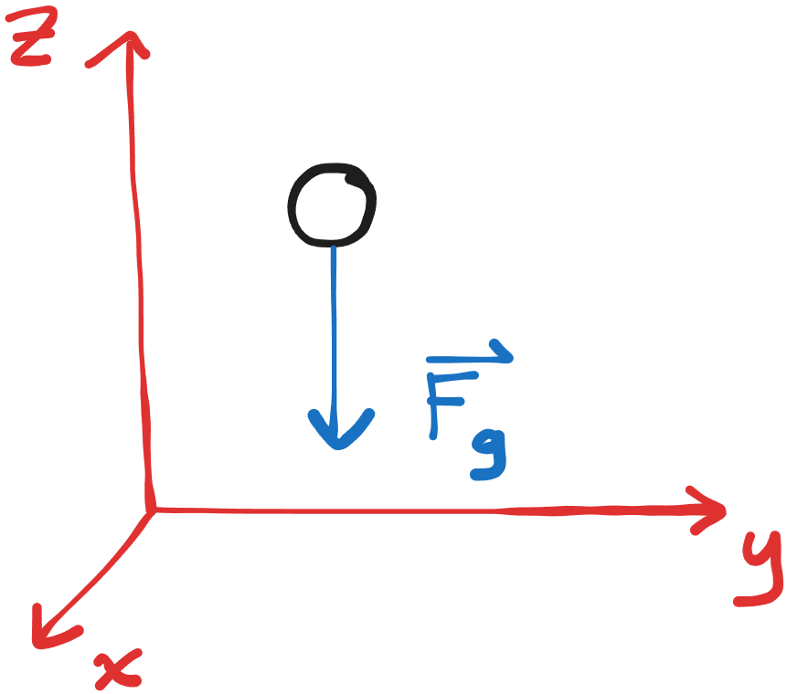
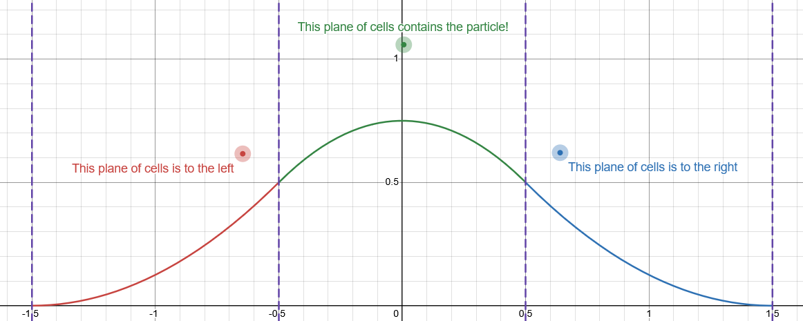

# WebGPU snow sim
This project contains a snow simulation engine using the **material point method** (**MPM**) algorithm.

## Code
This is a SvelteKit project with a simulation powered by WebGPU, so you can [view this demo online](https://luoluobuli.github.io/WebGPU-MPM-based-Snow-Simulation/) so long as your browser supports WebGPU!

### Local development
After cloning this repository:
1. Setup: `npm i` (Node.js) or `deno i` (Deno)
1. Run: `npm run dev` or `deno task dev`

## Motivation
Existing simulation systems in 3D tools like Blender are somewhat limited. There are simulations for mesh-based solids (cloth/rigid body) and simulations for particle-based solids (soft body), liquid (fluid), and gas (smoke). However, at present, there isn't exactly a solution for fragile materials like snow or jelly that only sometimes stay together and sometimes break apart.

The closest practical solution there is is to pre-fracture a mesh, sometimes manually if there are not many pieces or otherwise using a "cell fracture" mechanism which tends to be pretty easy to spot visually. In movies, simulations have evolved to use certain techniques which better support semi-solid materials. For this project, we'll focus on the "material point method", which is an algorithm often leveraged for snow, as with *Frozen* in 2013. One goal of this project is to implement and describe this technique in an accessible and customizable way, both to demonstrate its benefits as well as lay the groundwork for engine implementations for artistic use in tools like Blender.

An additional point of interest is animated characters. Even in industry tooling, characters made of a simulatable material like sand, snow, or water often simply consist of a mesh styled to look like the material, with a particle system on its surface. A large amount of manual labor is necessary to model simple interactions with other characters or meshes in a believable way, such as controllers to decide when and where to fracture the mesh into pre-factured pieces or blend between the mesh and a particle system. We'd like to investigate how easily a simulation can achieve similar results; importing meshes and animations to the scene, while maintaining ease of artistic control, is an additional point of interest.

## Implementation
Let's walk through the implementation of the simulation from the ground up.

### Particles and external forces
We'll start with a simple particle simulation. We'll spawn a certain number of particles making up our material. They each have their own position $\mathbf x$ in meters $\text m$, velocity $\mathbf v$ in meters per second $\dfrac {\text m}{\text s}$, and mass $m$ in kilograms $\text{kg}$.
```wgsl
struct Particle {
    position: vec3f,
    velocity: vec3f,
    mass: f32,
}
```
Every timestep (of a fixed duration $\Delta t$ in seconds $\text s$), we'll calculate the *external force* $\mathbf F_\text{ext}$ (in newtons $\text N$) on each particle. For now, the only force we'll calculate is a constant gravity force $\mathbf F_\text{ext} = \mathbf F_g = m \cdot \langle 0, 0, -9.81 \rangle \text{ N}$ (where +z is our "up" vector).



Using [Newton's second law of motion](https://en.wikipedia.org/wiki/Newton%27s_laws_of_motion), we can obtain the acceleration on each particle in meters per second per second $\dfrac {\text m}{\text s^2}$: $\mathbf F_\text{ext} = m \mathbf a \implies \mathbf a = \dfrac{\mathbf F_\text{ext}} m = \langle 0, 0, -9.81 \rangle \text{ }\dfrac {\text m}{\text s^2}$. (If we wanted, we could also add some user-controlled forces so we can grab and throw the particles from the UI, to make sure our simulation works with all kinds of forces.)

We now have the rate of change of position (velocity) as well as the rate of change of velocity (acceleration). To update our particles' states, we'll use [Euler integration](https://en.wikipedia.org/wiki/Euler_method), or simply multiplying the rates of change by our timestep $\Delta t$, to obtain the velocity and position of the particle in the next frame:
$$
\begin{align*}
    \mathbf v_{\text{next}} &:= \mathbf v + \mathbf a \cdot \Delta t \\
    \mathbf x_{\text{next}} &:= \mathbf x + \mathbf v \cdot \Delta t
\end{align*}
$$

If we do a timestep or a few every frame, our particles should now fall downward!

### Material point method
Now our particles are all moving independently of each other, so they're all acting like separate objects rather than a continuous material.

**Material point method** (**MPM**) is a technique that will help us model the *cohesion* of our material. With MPM, we'll treat each particle as a **material point**, or a sample of how a continuous, deformable material is moving or deformed at a certain point in space. MPM will introduce a *grid* that we'll modify with our forces, rather than the particles directly.

We can divide the main MPM algorithm into 4 steps:

1. **Particle-to-grid (P2G).** Transfer the momentum $\mathbf p = m\mathbf v$ and mass of each particle to grid cells that are near the particle. To do this transfer, we'll weight the particle's *influence* on those grid cells based on the distance of the cell's center from the particle.
1. **Grid update.** Update each grid cell's momentum and mass using our external forces.
1. **Grid-to-particle (G2P).** Transfer the momentum of each grid cell back to the particles in its vicinity.
1. **Grid clear.** Zero out all the grid cell momentums and masses, so the next frame can do this process over again.

#### Particle-to-grid
First, we need to transfer the momentum and mass of each particle to grid cells that are near the particle. To do this transfer, we'll weight the particle's *influence* on those grid cells based on the distance of the cell's center from the particle.

We'll need to calculate which grid cell each particle belongs to, as well as the fractional positions in the cell (how far along in each direction the particle is within the cell, as a percentage) $\verb|frac_pos: vec3f|$. This can be done knowing the position $\verb|grid_min: vec3f|$ where the grid starts as well as the size $\verb|grid_cell_dims: vec3f|$ of each cell in each direction $x,y,z$ (which we'll write as a subscript $a$ here):

$$
\begin{align*}
    \verb|cell_number|_a &:= \left\lfloor \frac{\mathbf x_a - \verb|grid_min|_a}{\verb|grid_cell_dims|_a} \right\rfloor \\
    \verb|frac_pos|_a &:= \dfrac{\mathbf x_a - \verb|grid_min|_a - \verb|cell_number|_a \cdot \verb|grid_cell_dims|_a}{\verb|grid_cell_dims|_a}
\end{align*}
$$


For the weights themselves, we'll use a computationally cheap formula for the weights, a **quadratic B-spline** based on the particle's fractional position in the cell.

To do this, we'll want to take the 27 nearest cells to the particle (or the 3 nearest *2D planes* of cells in each axis). Let's then calculate the amount of influence on the neighboring planes, or the **weights** $\verb|weight|_{a, b}$ where $a$ is the axis and $b$ is how many planes over it is in that axis, relative to the particle.

> [!tip]
> For example, in the diagram above, $\verb|weight|_{y, 0}$ is the weight for the column of cells containing the particle, $\verb|weight|_{y, -1}$ is the weight for the column of cells to the *left*, and $\verb|weight|_{y, 1}$ is the weight for the column of cells to the *right*.

$$
\begin{align*}
    \verb|weight|_{a, -1} &:= 0.5 \cdot (1 - \verb|frac_pos|_a)^2 \\
    \verb|weight|_{a, 0} &:= 0.75 - (\verb|frac_pos|_a - 0.5)^2 \\
    \verb|weight|_{a, 1} &:= 0.5 \cdot (\verb|frac_pos|_a)^2
\end{align*}
$$

(All cells where $b < -1$ or $b > 1$ are assigned a weight of $0$.)

For a single plane of cells, these formulae result in the following weights based on the particle's distance from that plane's center in each axis:

[](https://www.desmos.com/calculator/onwvmn9wtf)
*(click to open in Desmos)*

This should give us 3 weight values for each cell (1 for each axis), which we can multiply together to obtain the overall weight $w$ of the cell.

Finally, we can calculate the amount of momentum and mass to transfer to each grid cell:

$$
\begin{align*}
    \verb|grid_cell_momentum| &\verb| += | w \cdot \mathbf p \\
    \verb|grid_cell_mass| &\verb| += | w \cdot m
\end{align*}
$$

Sum up these values for every particle, and we're now ready to apply forces!

#### Grid update
> [!note]
> TBD

#### Grid-to-particle
> [!note]
> TBD

#### Grid clear
> [!note]
> TBD

### Internal forces and stress
> [!note]
> TBD

At this point, we can now properly handle external forces like gravity. However, 

#### Plasticity
> [!note]
> TBD

### Position-based material point method (PBMPM)
> [!note]
> TBD

### Raymarching
> [!note]
> TBD

## Resources
1. **[Breakpoint](https://github.com/danieljgerhardt/Breakpoint).** A DirectX implementation of 3D PBMPM with mixed material types, along with a mesh shading renderer.
1. **[GPUMPM](https://github.com/kuiwuchn/GPUMPM).** A CUDA implemenation of MPM, associated with the 2019 paper ***[GPU optimization of material point methods](https://dl.acm.org/doi/10.1145/3272127.3275044)***.
1. **[PB-MPM](https://github.com/electronicarts/pbmpm).** The original WebGPU proof-of-concept implementation of 2D PBMPM with various material types, associated with the original 2024 paper introducing PBMPM, ***[A Position Based Material Point Method](https://media.contentapi.ea.com/content/dam/ea/seed/presentations/seed-siggraph2024-pbmpm-paper.pdf)***. *(although internal forces seem to be broken at the moment, as of 2025-11-21...)*
1. ***[Principles towards Real-Time Simulation of Material Point Method on Modern GPUs](https://arxiv.org/pdf/2111.00699)*.** A 2021 paper covering GPU optimizations of MPM.

[Project presentation slides](https://docs.google.com/presentation/d/1KzaJZwBxE9-vjqXS8KjHvptEbJPF9yljNl7gesTuuB4/edit?usp=sharing)

## Acknowledgments

### Libraries used
1. **[SASS](https://sass-lang.com/).** CSS preprocessing.
1. **[SvelteKit](https://svelte.dev/).** UI/reactivity.
1. **[THREE.js](https://threejs.org/).** gLTF/gLB loading.
1. **[Vite](https://vite.dev/).** Bundling and development environment.
1. **[wgpu-matrix](https://github.com/greggman/wgpu-matrix).** Helper classes for operations involving WGSL builtins on the CPU.
